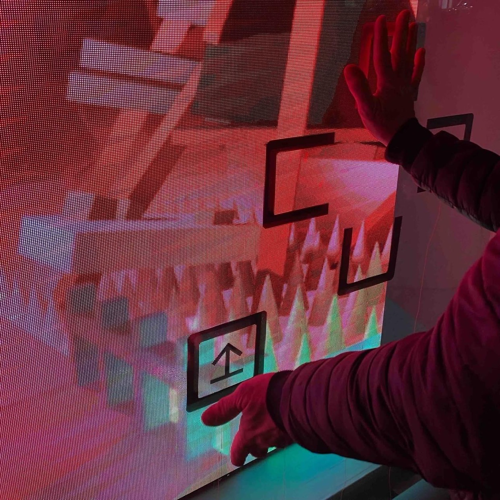

# vitrine
Sensitive window used for playing games on a showcase from the street.

Arduino 
* Hardware based on ESP32S3
* Touch sensor features are used to detect gestures from the other side of the glass, thanks to antennas
* Microcontroler board acts as a USB keayboard

